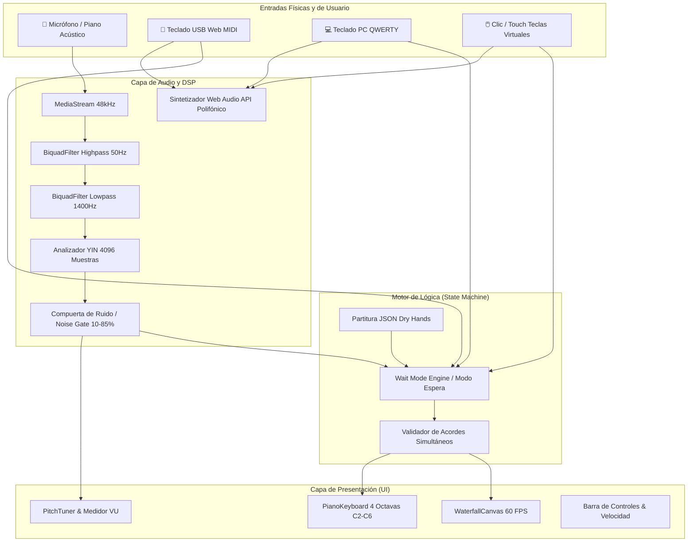
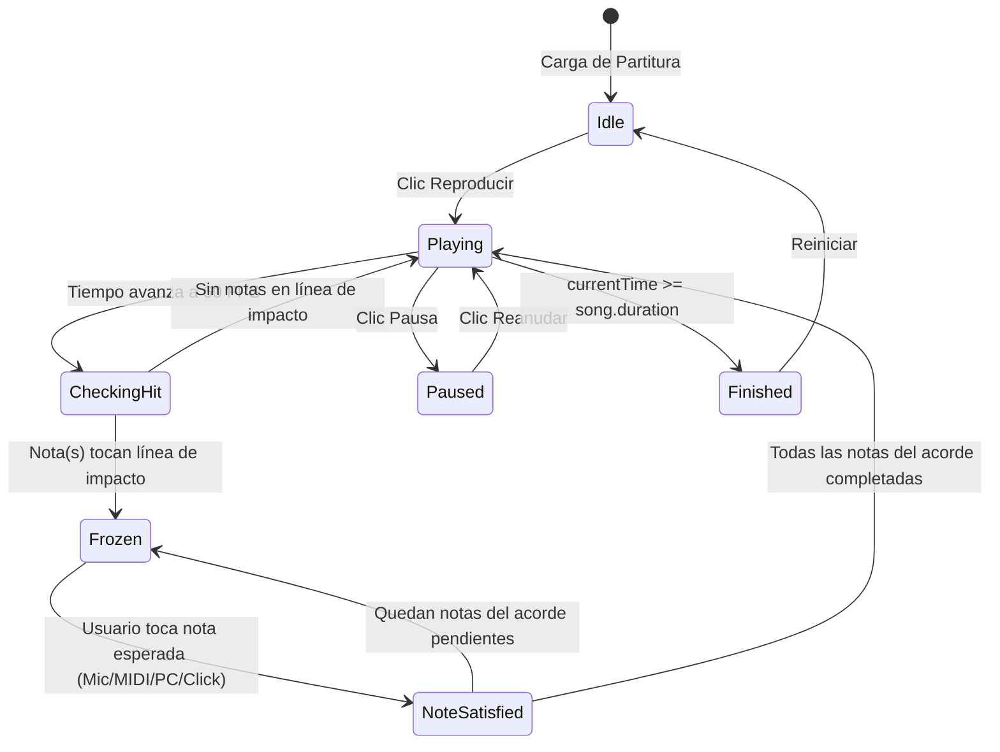

# 📐 Especificaciones Técnicas y de Arquitectura (Specs)
## MidiPiany - Synthesia Waterfall & Interactive Piano Tutor

---

## 1. Visión General del Sistema
**MidiPiany** es una plataforma web interactiva de aprendizaje de piano asistido por computadora inspirada en *Synthesia*, diseñada para ejecutarse en navegadores web modernos sin plugins adicionales. Permite a estudiantes practicar tanto con teclados virtuales y MIDI USB como con **pianos acústicos reales** mediante análisis acústico y detección de tono en tiempo real vía micrófono.

### Objetivos Clave:
- **Latencia de Audio:** $< 25\text{ ms}$ desde el golpe físico hasta la validación visual.
- **Tasa de Refresco:** $60\text{ FPS}$ estables mediante renderizado optimizado en HTML5 Canvas 2D.
- **Precisión Acústica:** Discriminación robusta de notas graves (hasta $55\text{ Hz}$) y rechazo activo de ruido ambiental mediante una compuerta de ruido (*Noise Gate*) adaptativa.

---

## 2. Arquitectura General y Flujo de Datos



---

## 3. Especificación de Procesamiento Digital de Señales (DSP)

### 3.1 Captura y Pre-filtrado Acústico
- **Configuración de `navigator.mediaDevices.getUserMedia`:**
  - `echoCancellation: false` — Previene la atenuación de armónicos naturales del piano acústico por algoritmos de telecomunicaciones (WebRTC).
  - `autoGainControl: false` — Evita que el navegador amplifique el siseo o ruido de fondo en momentos de silencio.
  - `noiseSuppression: false` — Conserva la envolvente transitoria del golpe del martillo en la cuerda.
- **Cadena de Filtros en Cascada (Web Audio API):**
  1. `BiquadFilterNode (Highpass, 50 Hz, Q: 0.7)`: Corta zumbidos eléctricos de red eléctrica ($50\text{ Hz}/60\text{ Hz}$) y vibraciones mecánicas del escritorio.
  2. `BiquadFilterNode (Lowpass, 1400 Hz, Q: 0.7)`: Elimina ruido blanco, ventiladores y siseos de alta frecuencia por encima de la tesitura de estudio.

### 3.2 Algoritmo de Detección de Tono (YIN Extendido)
Para resolver el fenómeno de la **Fundamental Ausente** en pianos acústicos (donde el 2do armónico suele tener mayor energía que la fundamental física en micrófonos de laptop), el analizador utiliza el algoritmo YIN implementado con:
1. **Tamaño de Buffer FFT:** $4096\text{ muestras}$ ($85.3\text{ ms}$ a $48\text{ kHz}$).
   - Para $A2$ ($110\text{ Hz}$, $T = 436\text{ muestras}$), el buffer captura $\approx 4.7$ periodos completos, garantizando convergencia matemática.
   - Para $D2$ ($73.4\text{ Hz}$, $T = 654\text{ muestras}$), captura $\approx 3.1$ periodos completos.
2. **Función de Diferencia Normalizada Acumulativa:**
   $$d'_t(\tau) = \begin{cases} 1 & \text{si } \tau = 0 \\ \frac{d_t(\tau)}{\frac{1}{\tau}\sum_{j=1}^\tau d_t(j)} & \text{en otro caso} \end{cases}$$
3. **Umbral de Dip:** $\text{Threshold} = 0.22$. Si no se alcanza, se evalúa el mínimo local absoluto hasta $0.28$ (tolerancia para el batimiento de cuerdas al unísono de pianos reales).
4. **Interpolación Parabólica:**
   $$\delta = \frac{s_2 - s_0}{2(2s_1 - s_0 - s_2)}$$
   Frecuencia calculada: $f_0 = \frac{\text{sampleRate}}{\tau + \delta}$.

### 3.3 Compuerta de Ruido Interactiva (*Noise Gate*)
- **Umbral de Usuario (`userThreshold`):** Rango ajustable de $10\%$ a $85\%$ (por defecto $45\%$).
- **Filtro Estricto:** Si $\text{RMS} \times 20 < \text{userThreshold}$, el procesador **aborta el cálculo de tono inmediatamente**, garantizando $0\%$ de activaciones falsas en reposo.
- **Calibración Automática:** Mide el pico de ruido ambiente durante $1500\text{ ms}$ y asigna $\text{Umbral} = \min(85, \text{Pico} + 10)\%$.

### 3.4 Tolerancia de Octava (*Pitch-Class Equivalence*)
Si la tolerancia de octava está habilitada (`allowOctaveTolerance: true`):
$$\text{Hit válido} \iff (\text{midi}_{\text{detectado}} \bmod 12) = (\text{midi}_{\text{esperado}} \bmod 12)$$
Permite que armónicos detectados en $A3$ o $A4$ validen la ejecución de un bajo escrito en $A2$.

---

## 4. Motor de Síntesis Interna (Audio Engine)

- **Arquitectura de Voz Polifónica:**
  - **Oscilador Primario:** Onda Triangular afinada a $f_0$ para emular el cuerpo de madera.
  - **Oscilador Armónico (Tine):** Onda Sinusoidal afinada a $2f_0$ o $3f_0$ con decaimiento exponencial ultrarrápido ($\tau \approx 0.35\text{ s}$) para simular el impacto metálico del martillo.
  - **Filtro Dinámico:** Paso bajo con barrido de $1.8\times f_{\text{cutoff}} \rightarrow f_{\text{cutoff}}$ en $400\text{ ms}$.
  - **Etapa Máster:** Compresor dinámico (-12 dB, ratio 12:1) y ganancia regulada para evitar saturación (*clipping*) en acordes densos.
- **Regla Anti-Feedback:** Las notas originadas desde el micrófono **nunca** se retroalimentan al sintetizador para evitar bucles acústicos infinitos.

---

## 5. Especificación del "Modo Espera" (Wait Mode)

### Máquina de Estados de Reproducción:



- **Tolerancia Temporal de Acordes:** Notas con diferencia de inicio $\le 120\text{ ms}$ se agrupan en un único acorde sincrónico.
- **Línea de Impacto (*Hit-Line*):** Ubicada a $12\text{ px}$ del borde inferior del canvas.

---

## 6. Especificación del Waterfall Canvas y Teclado

### 6.1 Geometría Compartida de Teclas (`keyboardLayout.ts`)
- **Rango:** $C2$ (MIDI 36) a $C6$ (MIDI 84) — Total de 49 teclas (29 blancas, 20 negras).
- **Teclas Blancas:** Ancho uniforme del $100\% / 29 \approx 3.448\%$ del ancho total.
- **Teclas Negras:** Ancho del $62\%$ de una tecla blanca, centradas sobre la línea divisoria entre teclas blancas adyacentes.
- **Alineación:** Tanto las barras en caída en el Canvas como las teclas del DOM inferior utilizan exactamente la misma proyección horizontal porcentual (`leftPercent`, `widthPercent`).

### 6.2 Código Cromático por Mano
| Mano | Rol Musical | Color Principal | Código Hex |
|---|---|---|---|
| 🟣 **Izquierda** | Acompañamiento / Bajos | Púrpura / Violeta | `#8b5cf6` $\rightarrow$ `#c084fc` |
| 🔵 **Derecha** | Melodía Principal | Cian / Esmeralda | `#06b6d4` $\rightarrow$ `#38bdf8` |
| 🟡 **Objetivo Activo** | Nota en espera en Hit-Line | Amarillo Ámbar (Pulsante) | `#f59e0b` $\rightarrow$ `#fbbf24` |
| ⚪ **Acierto** | Explosión de Partículas | Blanco Brillante / Oro | `#ffffff` / `#fef08a` |

---

## 7. Esquema de Datos de Canciones (JSON Schema)

```typescript
export interface SongNote {
  id: string;        // Identificador único: note-[index]-[midi]-[time]
  note: string;      // Nombre con octava: ej. "A2", "C#4"
  midi: number;      // Número MIDI estándar (0 - 127)
  name: string;      // Nombre normalizado
  time: number;      // Tiempo de inicio en segundos (float)
  duration: number;  // Duración en segundos (float)
  hand: 'left' | 'right';
}

export interface Song {
  id: string;
  title: string;
  artist: string;
  bpm: number;
  duration: number;
  notes: SongNote[];
}
```

---

## 8. Mapeo de Entradas de Teclado PC (QWERTY)

| Teclas PC | Rango MIDI | Notas | Registro |
|---|---|---|---|
| `Z` `S` `X` `D` `C` `V` `G` `B` `H` `N` `J` `M` | 48 a 59 | $C3$ a $B3$ | Mano Izquierda / Grave |
| `Q` `2` `W` `3` `E` `R` `5` `T` `6` `Y` `7` `U` | 60 a 71 | $C4$ a $B4$ | Mano Derecha / Do Central |
| `I` `9` `O` `0` `P` | 72 a 76 | $C5$ a $E5$ | Mano Derecha / Agudo |

---

## 9. Requisitos No Funcionales y Compatibilidad

- **Navegadores Soportados:**
  - Google Chrome $\ge 90$ (Web Audio, Web MIDI nativo, Canvas 2D).
  - Apple Safari $\ge 14.1$ (Web Audio, Canvas 2D, soporte de micrófono).
  - Mozilla Firefox $\ge 88$ (Web Audio, Canvas 2D).
  - Microsoft Edge $\ge 90$.
- **Rendimiento:**
  - Presupuesto de renderizado Canvas: $< 8\text{ ms}$ por fotograma.
  - Consumo de memoria: $< 85\text{ MB}$ en ejecución continua.
  - Recolección de basura (*GC*): Reutilización estricta de buffers `Float32Array` en el bucle de audio para evitar pausas de GC.
